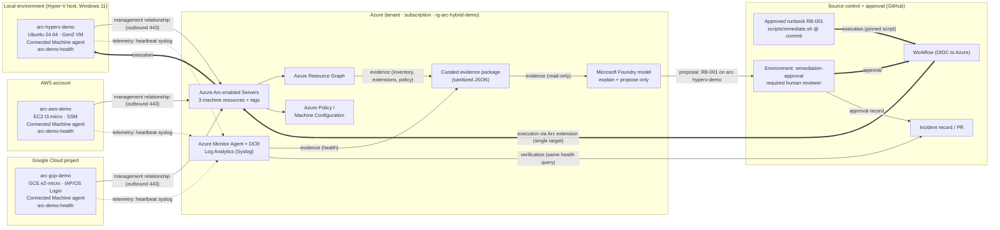

# Architecture

## Narrative

Linux servers run in three kinds of place and never leave them: **arc-aws-demo** on Amazon EC2, **arc-gcp-demo** on Google Compute Engine, and private infrastructure, represented in the CAS 2026 delivery by the pre-existing Arc server **arcs-lab-hybrid-prod-cus-01** (KVM lab host; read-only in the session) and optionally by **arc-hyperv-demo** on a Hyper-V laptop. Each runs Ubuntu 24.04 LTS, a harmless demo service (`arc-demo-health`, a local-only HTTP health endpoint) and a one-minute heartbeat that writes the service state to syslog.

Azure Arc gives each machine an **Azure resource identity** (`Microsoft.HybridCompute/machines`) in one resource group. That identity is what lets Azure tools treat the three machines as one fleet: tags (`CloudOrigin`), Resource Graph inventory, Azure Policy / Machine Configuration, Azure Monitor Agent with a Data Collection Rule into Log Analytics, and the Arc extension framework used for the approved remediation. Arc does **not** move, migrate, or host the machines; AWS and Google Cloud keep their own identity, networking and billing; and an ordinary Azure VM already has all of this natively, so it is not Arc-enabled.

The live fault runs on **arc-aws-demo**. The incident lifecycle is **Detect → Explain → Approve → Remediate → Verify → Document**:

| Stage | Deterministic component | Owner |
|---|---|---|
| Detect | `queries/arc-health.kql` over Log Analytics (same query before/during/after) + `queries/arc-inventory.kql` over Resource Graph | Instructor / automation |
| Explain | `scripts/collect-evidence.sh` builds a sanitized JSON package; `ai/explain-incident.sh` sends it with `ai/system-prompt.md` to a Microsoft Foundry model that may only cite evidence and name an approved runbook | AI layer (advisory) |
| Approve | GitHub Actions environment `remediation-approval` with required reviewers; approval record captured | Human |
| Remediate | `.github/workflows/remediate.yml` → OIDC login → Arc Custom Script Extension runs `scripts/remediate.sh` (RB-001) from the pinned commit on exactly one machine | Version-controlled runbook |
| Verify | Re-run `queries/arc-health.kql`; `remediate.sh` also re-runs `verify-health.sh` locally | Deterministic query |
| Document | Incident record (`evidence/incident-schema.json`) updated with approval, execution and before/after verification; PR to `evidence/` | Human + automation |

## Mermaid diagram

## Boundaries, identities, flows

| Concern | Hyper-V | AWS | Google Cloud | Azure | GitHub |
|---|---|---|---|---|---|
| Hosting boundary | Instructor laptop; Default Switch NAT | Dedicated VPC, public subnet, SG egress-only | Dedicated VPC, IAP ingress only | Resource group `rg-arc-hybrid-demo` | Repo `hcw-architect/Demo-CAS_02` |
| Trust boundary | Local admin on host | AWS IAM (instance role for SSM) | Google IAM (VM service account, OS Login) | Entra ID; Arc machine system-assigned identity | Environment protection rules |
| Authentication path | Device-code to Entra for `azcmagent connect` | AWS SSO profile (workstation); device-code in guest | ADC (workstation); device-code in guest | `az login` (workstation); OIDC federated credential (workflow) | `gh auth login`; OIDC token |
| Outbound flows | 443 → Arc endpoints, packages.microsoft.com | 443 → Arc endpoints, SSM endpoints | 443 → Arc endpoints | n/a | 443 → management.azure.com |
| Management traffic | Hyper-V console / optional SSH | SSM Session Manager (no inbound) | IAP TCP forwarding (no public SSH) | ARM + Arc extensions | Actions runner |
| Evidence flow | syslog → AMA → Log Analytics | same | same | ARG + LAW → `collect-evidence.sh` | Evidence committed sanitized |
| Approval boundary | — | — | — | — | `remediation-approval` environment |
| Remediation boundary | Only `arc-hyperv-demo` (guard in `remediate.sh`) | read-only during incident | read-only during incident | Extension scoped to one machine resource | Workflow input restricted to one choice |
| Credential storage | None on disk (device code) | `~/.aws` SSO cache on workstation only | `gcloud` ADC cache on workstation only | `az` token cache on workstation only | No secrets; OIDC + repo variables |
| Can read evidence | Instructor | — | — | AI layer (evidence package only) | Reviewer |
| Authorized to execute | Approved workflow only | — | — | Arc extension on named machine | After human approval |

## What depends on Azure Arc in this story

* The three machines appearing as **Azure resources** with tags, in one resource group, in one subscription.
* **Resource Graph** inventory across Hyper-V + AWS + GCP in one query.
* **Azure Policy** assessment and **Machine Configuration** (billable per Arc server) on non-Azure machines.
* **Azure Monitor Agent** via Arc extension + DCR, giving one Log Analytics health view.
* The **extension-based execution path** (Custom Script Extension, GA; Run Command, preview) used by the approved runbook.

What does **not** depend on Arc: the VMs themselves, their native cloud networking/identity, SSM/IAP access, Terraform, GitHub approvals, or the model. Arc is the bridge, not the host.
